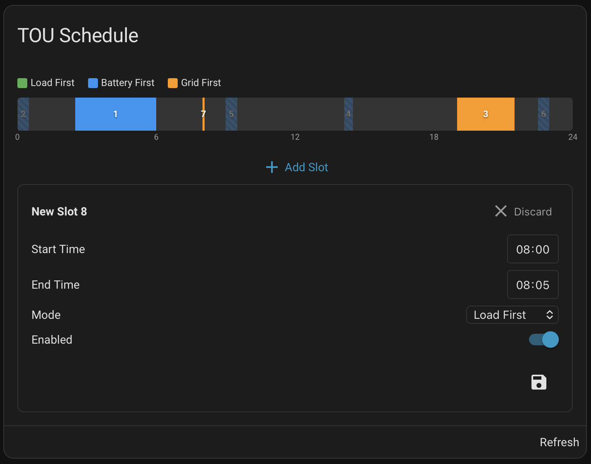

# Growatt TOU Schedule Card

A custom Lovelace card for Home Assistant that provides a visual interface for managing Time of Use (TOU) battery schedules on Growatt MIN inverters.

Works with the [growatt_server](https://github.com/johanzander/growatt_server_upstream) custom integration.



## Features

- 24-hour timeline visualisation of all 9 TOU segments
- Colour-coded by mode: Load First (green), Battery First (blue), Grid First (orange)
- Click any segment to edit start/end time, mode, and enabled state
- Disabled segments shown with reduced opacity and hatched overlay
- Overnight segments (e.g. 22:00–06:00) rendered as wrapped blocks
- GUI card editor with device picker

## Installation

### HACS (Recommended)

1. Open HACS in Home Assistant
2. Go to **Frontend** > **Custom repositories**
3. Add `https://github.com/pookey/growatt-tou-schedule-card` and select **Lovelace** as the category
4. Install **Growatt TOU Schedule Card**
5. Refresh your browser

### Manual

1. Download `dist/growatt-tou-schedule-card.js`
2. Copy it to `config/www/growatt-tou-schedule-card.js`
3. Add the resource in **Settings > Dashboards > Resources**:
   - URL: `/local/growatt-tou-schedule-card.js`
   - Type: JavaScript Module

## Usage

Add the card to a dashboard:

```yaml
type: custom:growatt-tou-schedule-card
device_id: <your_growatt_device_id>
title: TOU Schedule
```

Or use the visual card editor — search for "Growatt TOU Schedule" when adding a card.

### Finding your device ID

1. Go to **Settings > Devices & Services > Growatt Server**
2. Click your device
3. The device ID is in the URL: `.../config/devices/device/<device_id>`

## Requirements

- Home Assistant 2024.1+
- [growatt_server custom integration](https://github.com/johanzander/growatt_server_upstream) installed and configured with a MIN inverter
